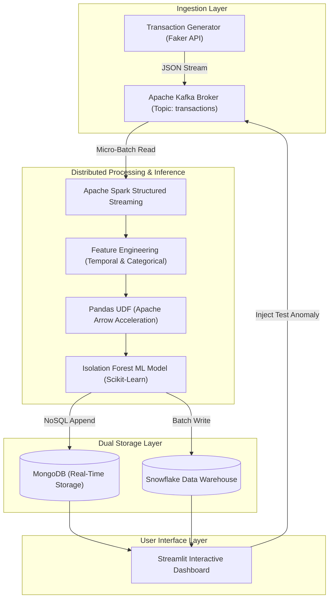

<div align="center">

# 💳 Real-Time Credit Card Anomaly Detection Pipeline
### High-Throughput Big Data Architecture using Apache Kafka, Apache Spark, Isolation Forest ML, MongoDB & Snowflake


</div>

---

## 🎓 Academic Project Information

- **Course**: Big Data Analytics (`22AIE312`)
- **Institution**: Dept. of Computer Science & Engineering, Amrita Vishwa Vidyapeetham, Chennai
- **Course Mentor**: **Dr. S. Saravanan**
- **Authors & Team Members**:
  - **Renuka V J** (`CH.SC.U4AIE23057`)
  - **Vaishnavi S** (`CH.SC.U4AIE23059`)

---

## 📌 Executive Summary

Modern financial ecosystems process thousands of credit card transactions per second. Traditional static rule-based fraud detection systems suffer from high false-positive rates and fail against evolving, previously unseen fraud vectors. 

This project implements an end-to-end **Real-Time Credit Card Anomaly Detection Pipeline** capable of sub-second streaming inference on distributed hardware:
- **Event Streaming**: Ingests continuous synthetic transaction webhooks at scale using **Apache Kafka**.
- **Stream Processing & Distributed ML**: Uses **Apache Spark Structured Streaming** with **PySpark Pandas UDFs** accelerated by **Apache Arrow** to score transactions in real time via an **Unsupervised Isolation Forest** model.
- **Dual Persistence Strategy**: Simultaneously routes processed events to **MongoDB** (for low-latency operational dashboarding) and **Snowflake** (for historical data warehousing and retroactive analytical queries).
- **Live Visualization**: Provides a interactive **Streamlit Dashboard** featuring live metrics, fraud rate analytics, custom SQL querying, and manual fraud injection capabilities.

---

## 🏗 System Architecture



---

## ✨ Key Technical Highlights

1. **High-Throughput Ingestion**: Event-driven architecture powered by Kafka guarantees message durability and decoupled processing.
2. **Distributed Machine Learning**: Inference executes directly on Spark worker nodes via vectorized Pandas UDFs, bypassing PySpark driver bottlenecks.
3. **Unsupervised Fraud Isolation**: Uses an `Isolation Forest` (`n_estimators=100`, `contamination=0.05`) trained on standardized monetary, temporal, and spatial vectors to identify novel anomalies without pre-labeled data.
4. **Dual Storage Sinks**:
   - **MongoDB**: Supports instant `GET` queries and live UI polling.
   - **Snowflake**: Supports long-term analytical workloads and regulatory compliance.
5. **Multi-Node Cluster Ready**: Dynamic IP binding enables horizontal cluster expansion across multiple laptops over local Wi-Fi networks.

---

## 📂 Repository Structure

```text
Credit-card-Anomaly-detection/
├── anomaly_detection/          # ML Model Training & Artifacts
│   ├── train_model.py          # Synthetic dataset generator & Isolation Forest training
│   ├── isolation_forest_model.pkl # Serialized Isolation Forest model binary
│   └── scaler.pkl              # Serialized StandardScaler binary
├── config/                     # System Configurations
│   ├── .env.example            # Template for environment secrets
│   └── .env                    # Local credentials (Git-ignored)
├── dashboard/                  # Visualization UI
│   └── app.py                  # Streamlit dashboard script
├── database/                   # Storage Connectors
│   └── snowflake_writer.py     # Snowflake connector and batch writer
├── producer/                   # Ingestion Producers
│   ├── kafka_producer.py       # Kafka stream producer
│   └── transaction_generator.py # Synthetic credit card transaction builder
├── spark_streaming/            # Core Big Data Pipeline
│   ├── schema.py               # Transaction DataFrame Schema
│   └── streaming_job.py        # Spark streaming job, Pandas UDF & MongoDB sink
├── .gitignore                  # Git exclusion rules
├── README.md                   # Project overview & documentation
├── TECHNICAL_GUIDE.md          # Multi-laptop cluster guide & technical specs
└── requirements.txt            # Python dependencies
```

---

## 🚀 Quickstart Guide

### 1. Prerequisites
- **Python 3.10+**
- **Java 11 or 17**
- **Apache Kafka 3.x**
- **MongoDB** running locally on port `27017`

### 2. Environment Setup

```bash
# Clone the repository
git clone https://github.com/Runa-Rameena/Credit-card-Anomaly-detection.git
cd Credit-card-Anomaly-detection

# Create and activate virtual environment
python3 -m venv venv
source venv/bin/activate

# Install dependencies
pip install -r requirements.txt

# Configure environment variables
cp config/.env.example config/.env
```

### 3. Step-by-Step Pipeline Execution

#### Step A: Train Machine Learning Model (Optional)
```bash
python -m anomaly_detection.train_model
```

#### Step B: Start Kafka Broker
```bash
# Start Zookeeper & Kafka Broker (in separate terminals)
zookeeper-server-start.sh config/zookeeper.properties
kafka-server-start.sh config/server.properties

# Create topic
kafka-topics.sh --create --topic transactions --bootstrap-server localhost:9092 --partitions 3 --replication-factor 1
```

#### Step C: Start Producer
```bash
python -m producer.kafka_producer
```

#### Step D: Run Spark Structured Streaming Job
```bash
python -m spark_streaming.streaming_job
```

#### Step E: Launch Dashboard
```bash
streamlit run dashboard/app.py
```
*Open `http://localhost:8501` in your browser.*

---

## 📊 Interactive Dashboard Features

- **Live System Metrics**: Monitors total transactions processed, anomaly count, live fraud rate percentage, and total monetary volume.
- **Real-Time Data Feed**: Live tabular feed backed by MongoDB.
- **Anomaly Alerts**: Immediate visual flags (`🚨 ANOMALY`) for transactions with decision scores `< 0`.
- **Distribution Analytics**: Interactive Plotly bar & histogram charts tracking volume per minute and amount distributions.
- **Snowflake SQL Console**: Allows direct execution of analytical SQL queries against Snowflake.
- **Manual Fraud Injection**: Dedicated button to trigger synthetic $45,000 darkweb transactions to test model detection latency live.

---

## 📖 Extended Documentation

For complete multi-laptop cluster deployment instructions, network configurations, database schemas, and troubleshooting, refer to:
👉 **[TECHNICAL_GUIDE.md](TECHNICAL_GUIDE.md)**

---

## 📄 License & Acknowledgments

This project was developed under the guidance of **Dr. S. Saravanan** at **Amrita Vishwa Vidyapeetham, Chennai** for the **Big Data Analytics (22AIE312)** course.
