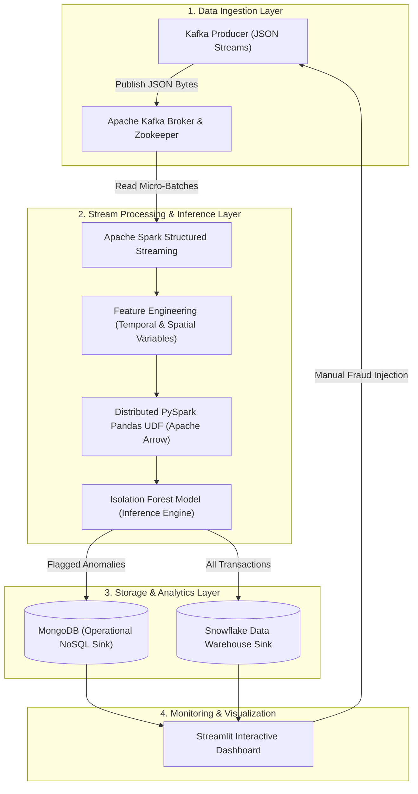
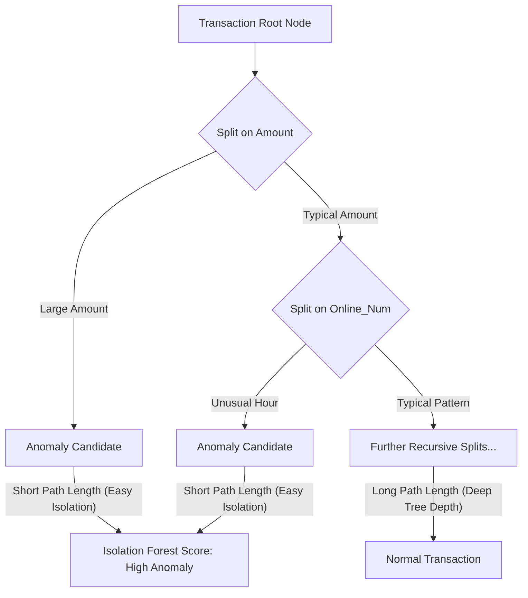

<div align="center">

# 💳 Real-Time Credit Card Anomaly Detection Pipeline

### Scalable Big Data Architecture Leveraging Apache Kafka, Apache Spark Structured Streaming, Isolation Forest ML, MongoDB & Snowflake


</div>

---

## 📌 1. Introduction & Background

The digital transformation of financial services has fueled a dramatic increase in credit card fraud, presenting a persistent and evolving challenge for financial institutions. Traditional fraud detection mechanisms—predominantly dependent on static, rule-based systems—are increasingly inadequate. They are inherently reactive, require constant manual heuristic updates, produce high false positive rates, and fail to catch sophisticated, previously unseen fraud patterns.

Delay in identifying fraudulent credit card transactions significantly exacerbates financial loss and complicates recovery efforts. This project directly addresses these limitations by establishing a **proactive, machine-learning-driven, sub-second latency pipeline** designed for real-time credit card anomaly detection.

### 🎯 Key Objectives
- **High-Throughput Data Ingestion**: Implement a robust data ingestion layer using **Apache Kafka** capable of streaming millions of events per second with minimal latency.
- **Distributed Real-Time Inference**: Perform low-latency anomaly detection by embedding an **Unsupervised Isolation Forest** model inside a distributed **Apache Spark Structured Streaming** cluster.
- **Dual-Sink Persistent Storage**: Establish a resilient storage strategy routing data to **MongoDB** (for real-time operational alerts) and **Snowflake** (for historical data warehousing and retroactive analytics).
- **Horizontal Scalability & Robustness**: Support dynamic horizontal node expansion across commodity hardware with fault-tolerant micro-batch processing.
- **Adaptive Anomaly Detection**: Automatically identify novel and evolving fraud vectors without relying on historical pre-labeled data.

---

## 📊 2. Dataset Description & Feature Engineering

The development and evaluation of this pipeline utilize a synthetically generated credit card transaction stream (`producer.transaction_generator`).

### Rationale for Synthetic Generation
1. **Regulatory Compliance & Data Privacy**: Eliminates Personally Identifiable Information (PII), adhering to PCI-DSS, GDPR, and CCPA constraints.
2. **Stress Testing**: Provides complete flexibility to simulate peak transaction volumes (e.g., 10,000 TPS) to test pipeline throughput and executor memory bounds.
3. **Controlled Pattern Simulation**: Programmatically injects subtle and extreme anomaly vectors to evaluate model recall under controlled conditions.

### Key Dataset Features
| Feature Name | Type | Description |
| :--- | :--- | :--- |
| `amount` | Float | Monetary value of the transaction. Essential for flagging anomalous high-value transactions. |
| `hour` | Integer | Hour of the day (0-23) extracted from timestamp. Used to identify transactions occurring outside typical spending hours. |
| `is_online_num` | Binary (0/1) | Indicates whether the transaction occurred online (`1`) or in-person (`0`). |
| `latitude` / `longitude` | Float | Geographic origin coordinates used to detect distance discrepancies and geographic outliers. |

---

## 🏗 3. System Architecture & Component Breakdown



### Detailed Component Analysis

#### 3.1 Apache Kafka & Zookeeper (Ingestion Layer)
Apache Kafka functions as the immutable distributed commit log and event bus for high-volume ingestion. Zookeeper handles broker coordination and cluster state metadata. The Kafka producer serializes synthetic JSON transactions into raw byte payloads transmitted over designated Kafka topics (`transactions`).

#### 3.2 Apache Spark Structured Streaming (Compute Engine)
Spark consumes the unbounded transaction stream in discrete micro-batches. Structured Streaming converts incoming raw JSON bytes into typed PySpark DataFrames, preparing data for feature extraction and parallelized model inferencing across executor nodes.

#### 3.3 PySpark Pandas UDF with Apache Arrow (Distributed Inference)
Executing traditional Python ML models inside PySpark often incurs heavy serialization overhead between the JVM and Python interpreter. This pipeline solves this bottleneck by using a **PySpark Pandas UDF** integrated with **Apache Arrow**:
- Zero-copy Arrow data transfers minimize JVM-Python serialization latency.
- Partitioned micro-batch data is streamed directly to Pandas DataFrames on worker nodes.
- Pre-trained model artifacts predict anomaly scores in parallel directly on executor RAM.

#### 3.4 MongoDB (Operational Sink)
Anomalous transactions and their associated metadata are written directly to **MongoDB**. This NoSQL document database delivers high-performance read/write speeds, serving as the backend for immediate operational alerts and real-time dashboard polling.

#### 3.5 Snowflake (Analytical Data Warehouse Sink)
All processed records—regardless of anomaly status—are concurrently persisted into **Snowflake tables**. Snowflake provides long-term historical data storage, complex analytical querying, business intelligence, and training data staging for future model iterations.

---

## 🌲 4. Machine Learning & Anomaly Isolation Logic

### Model Rationale: Isolation Forest
Traditional supervised models require vast historical datasets of pre-labeled fraud, which rapidly become outdated as attack vectors evolve. The **Isolation Forest** algorithm operates without explicit labels under the principle that anomalies are **"few and different"**. 

Isolation Forest constructs an ensemble of Isolation Trees (`iTrees`) by recursively partitioning features. Because anomalous points lie on the far mathematical tail of feature distributions, they require significantly fewer logical splits to isolate, resulting in noticeably shorter tree path lengths compared to dense, normal transaction clusters.



### Model Specifications & Hyperparameters
- **Ensemble Estimators (`n_estimators = 100`)**: Sets 100 individual isolation trees to achieve stable decision bounds without excessive computational overhead.
- **Contamination Ratio (`contamination = 0.05`)**: Defines the expected outlier threshold, flagging approximately 5% of incoming streaming volume as anomalous.
- **Feature Preprocessing (`StandardScaler`)**: Numerical vectors (`amount`, `hour`, `latitude`, `longitude`) are transformed to mean=0 and variance=1 to prevent high-magnitude features from dominating splits.
- **Serialization (`joblib`)**: Pre-trained model (`isolation_forest_model.pkl`) and fitted scaler (`scaler.pkl`) are serialized and distributed to worker nodes.
- **Anomaly Flagging Logic**: Decision function outputs `< 0` (predict output `-1`) flag the transaction as `rule_anomaly = True`.

---

## 📊 5. Real-Time Visualization Using Streamlit

The visualization layer is built using **Streamlit** to bridge backend analytics with user monitoring:

- **Live Metrics Dashboard**: Real-time display of total processed transactions, anomaly count, fraud rate percentage, and gross transaction volume.
- **Snowflake Warehouse Statistics**: Synchronized historical record counts and stored anomaly totals.
- **Recent Transactions Feed**: Dynamic tabular view showing transaction IDs, Card IDs, timestamps, amounts, merchants, geographic locations, and real-time status flags (`🚨 ANOMALY` vs `✅ Normal`).
- **Distribution & Category Analytics**: Interactive Plotly bar graphs and histograms tracking transaction counts per minute, amount distributions, and merchant category breakdowns.
- **Manual Fraud Override Injector**: Allows users to instantly trigger synthetic $45,000 darkweb transactions to test model detection latency live.

---

## 📁 6. Repository Structure

```text
Credit-card-Anomaly-detection/
├── anomaly_detection/          # Machine learning model training & artifacts
│   ├── train_model.py          # Dataset generation & Isolation Forest training
│   ├── isolation_forest_model.pkl # Serialized Isolation Forest binary
│   └── scaler.pkl              # Serialized StandardScaler binary
├── config/                     # Configuration files
│   ├── .env.example            # Environment variables template
│   └── .env                    # Local credentials (Git-ignored)
├── dashboard/                  # Streamlit monitoring UI
│   └── app.py                  # Live metrics, distribution graphs & manual overrides
├── database/                   # Database integrations
│   └── snowflake_writer.py     # Snowflake connector & batch writer
├── producer/                   # Ingestion producers
│   ├── kafka_producer.py       # Stream producer to Kafka topics
│   └── transaction_generator.py # Synthetic transaction generator
├── spark_streaming/            # Core Spark Structured Streaming pipeline
│   ├── schema.py               # Spark DataFrame schema definition
│   └── streaming_job.py        # Streaming logic, Arrow UDF & MongoDB sink
├── .gitignore                  # Git exclusion configuration
├── README.md                   # Project overview & technical documentation
├── TECHNICAL_GUIDE.md          # Multi-laptop cluster guide & database specs
└── requirements.txt            # Python dependencies
```

---

## 🚀 7. Execution & Setup Guide

### 7.1 Prerequisites
- **Python 3.10+**
- **Java 11 or 17**
- **Apache Kafka 3.x**
- **MongoDB** running on `localhost:27017`

### 7.2 Installation

```bash
# Clone the repository
git clone https://github.com/Runa-Rameena/Credit-card-Anomaly-detection.git
cd Credit-card-Anomaly-detection

# Create and activate Python virtual environment
python3 -m venv venv
source venv/bin/activate

# Install dependencies
pip install -r requirements.txt

# Create local environment config
cp config/.env.example config/.env
```

### 7.3 Pipeline Execution Steps

#### Step 1: Train the Anomaly Detection Model
```bash
python -m anomaly_detection.train_model
```

#### Step 2: Start Zookeeper & Kafka Broker
```bash
# Terminal 1: Zookeeper
bin/zookeeper-server-start.sh config/zookeeper.properties

# Terminal 2: Kafka Broker
bin/kafka-server-start.sh config/server.properties

# Terminal 3: Create Topic
bin/kafka-topics.sh --create --topic transactions --bootstrap-server localhost:9092 --partitions 3 --replication-factor 1
```

#### Step 3: Run Transaction Producer
```bash
python -m producer.kafka_producer
```

#### Step 4: Launch Spark Streaming Pipeline
```bash
python -m spark_streaming.streaming_job
```

#### Step 5: Start Streamlit Dashboard
```bash
streamlit run dashboard/app.py
```
*Open `http://localhost:8501` to view the live dashboard.*

---

## 💻 8. Distributed Multi-Laptop Cluster Deployment

For complete multi-node network instructions over Wi-Fi, environment variables configuration, MongoDB JSON schemas, and Snowflake DDL scripts, refer to:

👉 **[TECHNICAL_GUIDE.md](TECHNICAL_GUIDE.md)**
